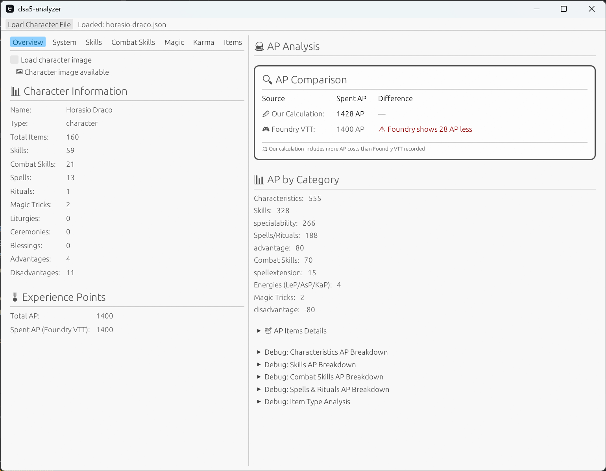

# DSA5 Character Analyzer

A desktop application for analyzing DSA5 (Das Schwarze Auge) character sheets exported from Foundry VTT.

> **Note**: This is an experimental project created to explore Rust and modern tooling. While functional, the code is not production-polished. Contributions and feedback welcome!
>
> **Disclaimer**: This is an unofficial tool for personal use. Not affiliated with Ulisses Spiele or Foundry Gaming LLC.

## Features

- 📊 **Adventure Point (AP) Analysis** - Detailed breakdown of AP spending across different categories
- 🎮 **Foundry VTT Integration** - Direct import of character JSON exports
- 🧮 **AP Calculation** - Independent bottom-up AP calculation to verify character progression costs
- 🔍 **AP Verification** - Detects discrepancies between Foundry's incremental AP tracking and actual character values
- 📋 **Character Overview** - Comprehensive view of character stats, skills, and equipment
- 📑 **Tabbed Interface** - Organized view with Overview, Skills, Items, and System tabs

> **Current Limitation**: Designed and tested for human characters. Others (elves, dwarfs, etc.) may not calculate correctly.

## Screenshot



## Download & Installation

### 📥 Portable executable

Download the latest portable executable for your platform from the [Releases page](https://github.com/bernhard-thiele/dsa5-analyzer/releases):

- **Windows**: `dsa5-analyzer.exe`
- **macOS**, **Linux**: Currently untested platforms. Build from source recommended

No installation required - just download and run!

### 🔧 Build from Source

If you prefer to build from source or want the latest development version:

```bash
# Prerequisites: Rust 1.70+
git clone https://github.com/yourusername/dsa5-analyzer.git
cd dsa5-analyzer
cargo run --release
```

## Usage

1. Launch the application
2. Click "Load Character File" and select your exported JSON file
3. View character statistics and AP analysis in the tabbed interface

---

## For Developers

### Project Structure

```
src/
├── main.rs                 # Application entry point
├── app.rs                  # Application layer (state + coordination)
├── character/              # 🏗️ DOMAIN LAYER
│   ├── mod.rs              # Domain module coordination
│   ├── analysis.rs         # AP calculation and game rule logic  
│   └── data.rs             # Character data structures and data access methods
└── ui/                     # 🎨 PRESENTATION LAYER
    ├── mod.rs              # UI module coordination
    ├── analysis_view.rs    # AP analysis dashboard
    ├── character_view.rs   # Character display
    └── file_dialog.rs      # File loading UI
```

## License

This project is licensed under the BSD-3-Clause License, see the [LICENSE](LICENSE) file for details.

## Acknowledgments

- Built with [egui](https://github.com/emilk/egui) for the GUI
- Designed for use with [Foundry VTT](https://foundryvtt.com/) DSA5 system
- **Trademarks**: DSA5 and "Das Schwarze Auge" are trademarks of Ulisses Spiele. Foundry Virtual Tabletop is a trademark of Foundry Gaming LLC. This project is not affiliated with or endorsed by Ulisses Spiele or Foundry Gaming LLC.
